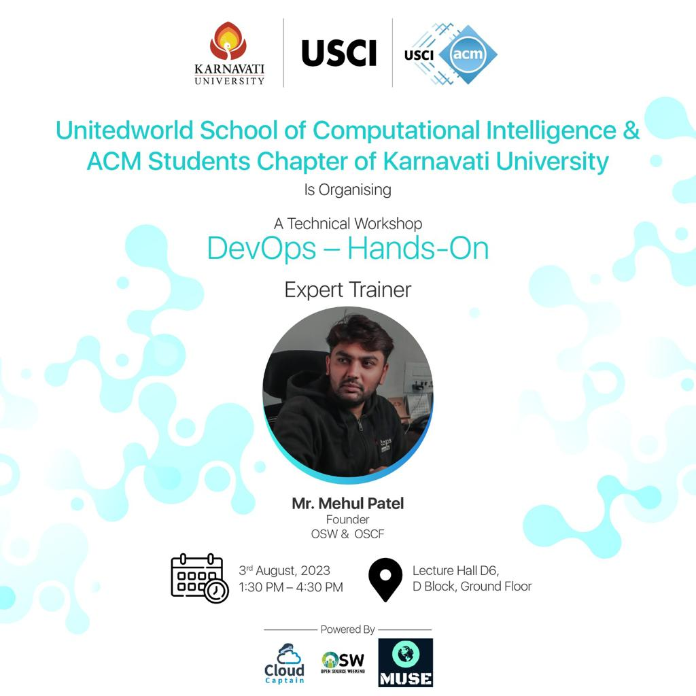

📢Join us for a [One Day workshop](https://www.meetup.com/docker-ahmedabad/events/294404615/) on Docker and Kubernetes!

### Talk Details 

#### Speaker : [Mehul Patel](https://twitter.com/NomadicMehul)

* **Title**: DevOps 101
* **Talk Abstract**: Cover the beginner friednly DevOps workshop covering tools like Git, Docker, Terraform and GCP. 

* 🪪 [Presentation Deck](./Mastering%20Docker_%20Build%2C%20Deploy%2C%20and%20Run%20Your%20First%20Containerized%20App.pdf.pdf)

* ##### [Docker Basic Commands](https://github.com/nomadicmehul/CloudCaptain/blob/main/Docker/docker-basic-commands.md)   

* ##### [Complete Docker Guide](https://github.com/nomadicmehul/CloudCaptain/tree/main/Docker)

### Meetup Details 

* 🗓️ Date: 3rd August'23
* ⏰ Time: 01.30 PM to 04.30 PM
* 📍 Venue: Karnavati University, Gandhinagar

✅ Prerequisites:
- Bring your system (laptop) with you, should have Docker installed on it
- Should have minikube installed on your PC. 
- Sign up for a free trial on Google Cloud (not necessary)

<!-- TOC -->

Also, Don't forget to check out our project "[CloudCaptain](https://github.com/nomadicmehul/CloudCaptain)" and get all things cloud-related!  

We hope you find this project both informative and engaging.

Don't forget to star this project to show your support for our initiatives. 

Share your love on social media and proudly proclaim, *"Hey, I am a Cloud Captain! #BeaCloudCaptain!"* and included me in your journey by tagging me on [Twitter](https://twitter.com/NomadicMehul). 

<!-- TOC -->

## 🛡️ License

This project is licensed under the **MIT License** - see the [LICENSE](LICENSE) file for details.

